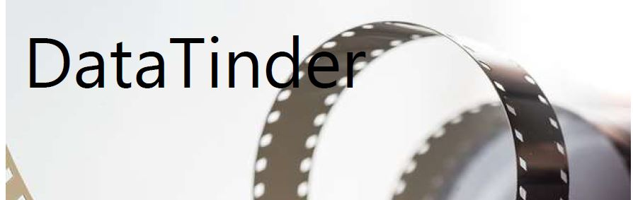
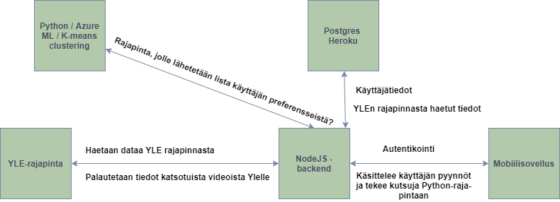

[![Contributors][contributors-shield]][contributors-url]
[![Issues][issues-shield]][issues-url]

[contributors-shield]: https://img.shields.io/github/contributors/jussihayha/DataTinderit.svg?style=for-the-badge
[contributors-url]: https://github.com/jussihayha/DataTinderit/graphs/contributors
[issues-shield]: https://img.shields.io/github/issues/jussihayha/DataTinderit.svg?style=for-the-badge
[issues-url]: https://github.com/jussihayha/DataTinderit/issues
[product-screenshot]: images/logo_viritys_transparent.png

# Sisällysluettelo
- [Sisällysluettelo](#sisällysluettelo)
  - [Projektin tausta](#Projektin-tausta)
  - [Konsepti](#konsepti)
  - [Käyttäjätarinat](#käyttäjätarinat)
    - [Loppukäyttäjä](#loppukäyttäjä)
    - [YLE](#yle)
  - [Tekninen kuvaus](#tekninen-kuvaus)
    - [Arkkitehtuuri](#arkkitehtuuri)
    - [NodeJS](#nodejs)
    - [Python/Azure/Jne](#pythonazurejne)
    - [Tietokanta](#tietokanta)

## Projektin tausta
Tämä repository on osa Haaga-Helia ammattikorkeakoulun Ohjelmistoprojekti II -kurssia. Kurssin tavoittena on luoda uusi sovellus, palvelu tai muita hyödyttävä opensource lisäosa käyttämällä avointa dataa. 

Kurssin yritysyhteistyökumppanina toimi YLE, joka esitteli omia avoimia rajapintojaan ja kertoi toiveistaan ja ideoistaa, että miten niitä voisi hyödyntää.

Päädyimme käyttämään Ylen Areena-rajapintaa, joka tarjoaa tietoa erilaisesta materiaalista, joka on saatavilla Areenan kautta. 

## Konsepti
Haluamme tarjota käyttäjälle sovelluksen, jolla voi hyödyntää Yle Areenan sisältöä. Konseptille on tarve, sillä Areenassa ei ole käyttäjäsidonnaista suosittelua. ​
Sovelluksemme antaa suosituksia Yle Areenan sisällöstä käyttäjälle, joka voi hyväksyä tai hylätä suositellut ehdotukset Tinderistä tutulla tavalla eli  "swaippaamalla" ne sovelluksen ruudulla oikealle tai vasemmalla. Jos sovelluksen antamasta ehdotuksesta "tykätään" (swaipataan oikealle), ehdotus siirtyy "tykkäsit näistä" -listalle. Jos käyttäjä avaa sovelluksen ensimmäisen kerran niin sovellus kertoo lyhyesti, että käyttäjän tulee swaippailla hetki ohjelmia ja mennä sen jälkeen katsomaan, että mitä suosituksia on saanut. ​
Viiden swaippauksen jälkeen käyttäjä ohjataan siirtymään listaruutuun.
* Listaruutu sisältää käyttäjälle suositeltuja ohjelmia. Suosittelut voivat koostua muiden käyttäjien suosituksista
* Suositussekoitus sisältää muutaman suosituksen knn-suosittelijasta, muutama täysin satunnainen suositus ja muutama tulee sen perusteella mistä käyttäjä on aiemmin tykännyt.
* Listaruudussa voi olla myös top 10 tykätyimmät ohjelmat sekä esimerkkinä vaikka komediat näkyvillä. 
​
## Käyttäjätarinat
Yleinen kuvaus tämän projektin sidosryhmistä, joista rakennamme käyttäjätarinoita.

### Loppukäyttäjä
Henkilö, joka käyttää sovellusta.

### YLE
Organisaatio, joka saa tietoa (dataa) sovelluksen käytöstä.

## Tekninen kuvaus
Tämä sisältää tarkempia kuvauksia käyttämistämme tekniikoista.

### Arkkitehtuuri
Kuvaus tekniikoiden ja rajapintojen yhteyksistä. Sanallisesti kuvattuna sekä visuaalisesti.

### NodeJS
Sanallisesti kuvattu, että mitkä on backendin merkityksellisimmät tehtävät projektissa.

### Python/Azure/Jne
Projektin pihvi. Se, millä tuotteella tai tavalla prosessoimme datan niin, että voimme toimittaa käyttäjälle (ja loppujen lopuksi) Ylelle lisäarvoa.

### Tietokanta
Kuvaus käyttämistämme tiedon säilömisen ratkaisuista ja lyhyet perustelut, että miksi mitäkin on käytetty. On mahdollista, että tietokantoja on useita, sillä kaiken datan ei välttämättä kannata asua samassa kannassa.

