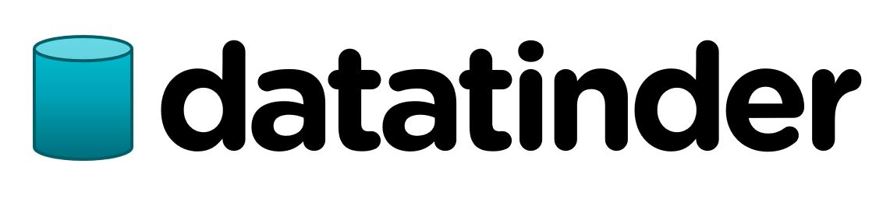

[![Contributors][contributors-shield]][contributors-url]
[![Issues][issues-shield]][issues-url]

[contributors-shield]: https://img.shields.io/github/contributors/jussihayha/DataTinderit.svg?style=for-the-badge
[contributors-url]: https://github.com/jussihayha/DataTinderit/graphs/contributors
[issues-shield]: https://img.shields.io/github/issues/jussihayha/DataTinderit.svg?style=for-the-badge
[issues-url]: https://github.com/jussihayha/DataTinderit/issues
[product-screenshot]: images/logo_viritys_transparent.png

# Sisällysluettelo
- [Sisällysluettelo](#sisällysluettelo)
  - [Taustat](#taustat)
  - [Konsepti](#konsepti)
  - [Käyttäjätarinat](#käyttäjätarinat)
    - [Loppukäyttäjä](#loppukäyttäjä)
    - [YLE](#yle)
  - [Tekninen kuvaus](#tekninen-kuvaus)
    - [Arkkitehtuuri](#arkkitehtuuri)
    - [NodeJS](#nodejs)
    - [Python/Azure/Jne](#pythonazurejne)
    - [Tietokanta](#tietokanta)

## Taustat 
Tämä repository on osa Haaga-Helia ammattikorkeakoulun Ohjelmistoprojekti II -kurssia. Kurssin tavoittena on luoda uusi sovellus, palvelu tai muita hyödyttävä opensource lisäosa käyttämällä avointa dataa. 

Kurssin yritysyhteistyökumppanina toimi YLE, joka esitteli omia avoimia rajapintojaan ja kertoi toiveistaan ja ideoistaa, että miten niitä voisi hyödyntää.

Päädyimme käyttämään Ylen Areena-rajapintaa, joka tarjoaa tietoa erilaisesta materiaalista, joka on saatavilla Areenan kautta. 

## Konsepti
Haluamme tarjota käyttäjälle sovelluksen, jolla voi hyödyntää Yle Areenan sisältöä. Konseptille on tarve, sillä Areenassa ei ole käyttäjäsidonnaista suosittelua. ​
Sovelluksemme antaa suosituksia Yle Areenan sisällöstä käyttäjälle, joka voi hyväksyä tai hylätä suositellut ehdotukset Tinderistä tutulla tavalla eli  "swaippaamalla" ne sovelluksen ruudulla oikealle tai vasemmalla. Jos sovelluksen antamasta ehdotuksesta "tykätään" (swaipataan oikealle), se siirtyy "tykkäsit näistä" -listalle. Tämän jälkeen sovellus tarjoaa vaihtoehtona joko jatkaa ehdotusten läpikäyntiä tai siirtyä katsomaan sisältöä. Suositukset tallentuvat käyttäjäkohtaisesti, ja käyttäjä voi palata uudestaan selaamaan ja muokkaamaan omaa katselulistaansa. Sovellus hyödyntää koneoppimista suositusten tekemisessä ja oppii suosittelemaan käyttäjälle sisältöä paremmin käyttäjän mieltymysten mukaan.​

Käyttäjä pystyy katsomaan Yle Areenan ohjelmia sovelluksen kautta ja antamaan niille arvosanan (1-5 tähteä) halutessaan. Sovellus myös raportoi ohjelmien katselutietoja Ylelle, mikä on Ylen rajapinnan käyttämisen ehtona.

## Käyttäjätarinat
Yleinen kuvaus tämän projektin sidosryhmistä, joista rakennamme käyttäjätarinoita.

### Loppukäyttäjä
Se, joka käyttää sovellusta.

### YLE
Se, joka saa tietoa sovelluksen käytöstä.

## Tekninen kuvaus
Tämä sisältää tarkempia kuvauksia käyttämistämme tekniikoista.

### Arkkitehtuuri
Kuvaus tekniikoiden ja rajapintojen yhteyksistä. Sanallisesti kuvattuna sekä visuaalisesti.

### NodeJS
Sanallisesti kuvattu, että mitkä on backendin merkityksellisimmät tehtävät projektissa.

### Python/Azure/Jne
Projektin pihvi. Se, millä tuotteella tai tavalla prosessoimme datan niin, että voimme toimittaa käyttäjälle (ja loppujen lopuksi) Ylelle lisäarvoa.

### Tietokanta
Kuvaus käyttämistämme tiedon säilömisen ratkaisuista ja lyhyet perustelut, että miksi mitäkin on käytetty. On mahdollista, että tietokantoja on useita, sillä kaiken datan ei välttämättä kannata asua samassa kannassa.

